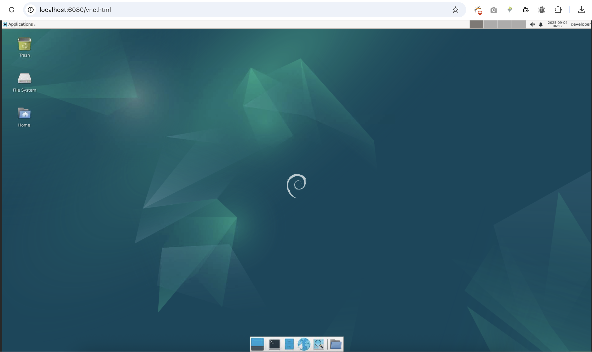

# BookWorm VNC Container



A Docker container based on Debian Bookworm with VNC server, noVNC web interface, VSCode, and Chromium browser.

## Quick Start with Pre-built Images

### Using Docker Hub Images (Recommended)

Pre-built multi-architecture images are available on Docker Hub:

```bash
# Pull and run the latest image
docker run -d \
  --name bookworm-vnc \
  -p 5901:5901 \
  -p 6080:6080 \
  -v $(pwd)/workspace:/home/developer/workspace \
  pushpenderindia/bookworm-vnc:latest
```

**Supported Architectures:**
- `linux/amd64` (x86_64)
- `linux/arm64` (ARM64/AArch64)

### Using Docker Compose with Pre-built Image

Create a `docker-compose.yml` file:

```yaml
services:
  bookworm-vnc:
    image: pushpenderindia/bookworm-vnc:latest
    ports:
      - "5901:5901"  # VNC port
      - "6080:6080"  # noVNC web interface port
    environment:
      - VNC_RESOLUTION=1920x1080
      - VNC_COL_DEPTH=24
    volumes:
      - ./workspace:/home/developer/workspace
    container_name: bookworm-vnc-container
    restart: unless-stopped
```

Then run:
```bash
docker-compose up -d
```

## Access Your Desktop

### noVNC Web Interface (Browser Access)
Open your browser and go to: `http://localhost:6080/vnc.html`

### VNC Client (Desktop Application)
- **Host**: `localhost`
- **Port**: `5901`
- **Password**: `developer`

## User Credentials

- **Username**: `developer`
- **Password**: `developer`

## System Requirements

**Recommended Memory**: 1GB RAM minimum
- VSCode requires 650-700MB RAM
- Firefox browser uses 80-150MB RAM
- Additional memory needed for XFCE desktop and other processes

## Features

- **Base**: Debian Bookworm (slim)
- **Desktop Environment**: XFCE4
- **VNC Server**: TightVNC
- **Web Interface**: noVNC (browser-based VNC client)
- **Applications**:
  - Visual Studio Code (with --no-sandbox configured)
  - Chromium browser
  - Firefox ESR
  - Git, Vim, Nano

## Ports

- **5901**: VNC server port
- **6080**: noVNC web interface port

## Workspace

The `./workspace` directory is mounted to `/home/developer/workspace` inside the container for persistent file storage.

## Environment Variables

- `VNC_RESOLUTION`: Screen resolution (default: 1920x1080)
- `VNC_COL_DEPTH`: Color depth (default: 24)
- `VNC_PORT`: VNC server port (default: 5901)
- `NO_VNC_PORT`: noVNC web port (default: 6080)

## Custom Build Setup

If you want to build the image yourself:

### Using Docker Compose

```bash
git clone https://github.com/PushpenderIndia/BookWormVNC.git
cd BookWormVNC
docker-compose up -d --build
```

### Using Docker directly

```bash
git clone https://github.com/PushpenderIndia/BookWormVNC.git
cd BookWormVNC

# Build the image
docker build -t bookworm-vnc .

# Run the container
docker run -d \
  --name bookworm-vnc \
  -p 5901:5901 \
  -p 6080:6080 \
  -v $(pwd)/workspace:/home/developer/workspace \
  bookworm-vnc
```

## Development

### Setting up GitHub Actions (for maintainers)

To enable automated Docker builds, add these secrets to your GitHub repository:

1. Go to your repository → Settings → Secrets and variables → Actions
2. Add the following repository secrets:
   - `DOCKER_USERNAME`: Your Docker Hub username
   - `DOCKER_PASSWORD`: Your Docker Hub password or access token

The workflow will automatically:
- Build multi-architecture images on every push to main
- Push images to Docker Hub with appropriate tags
- Update the Docker Hub repository description